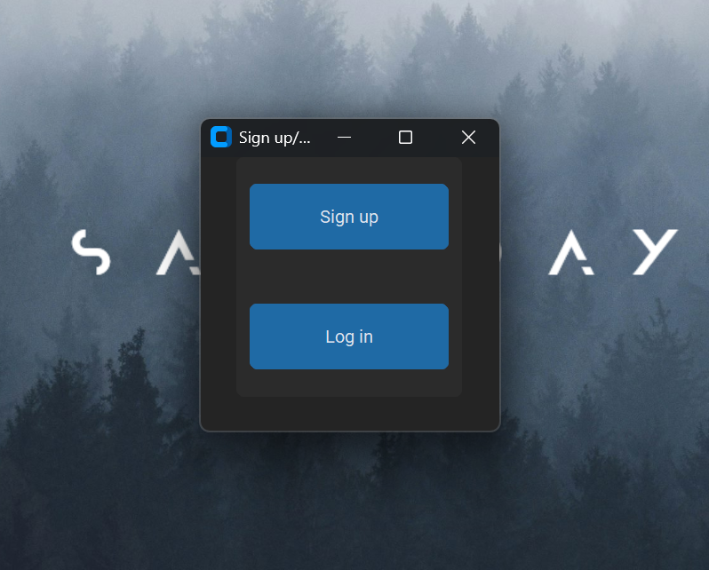
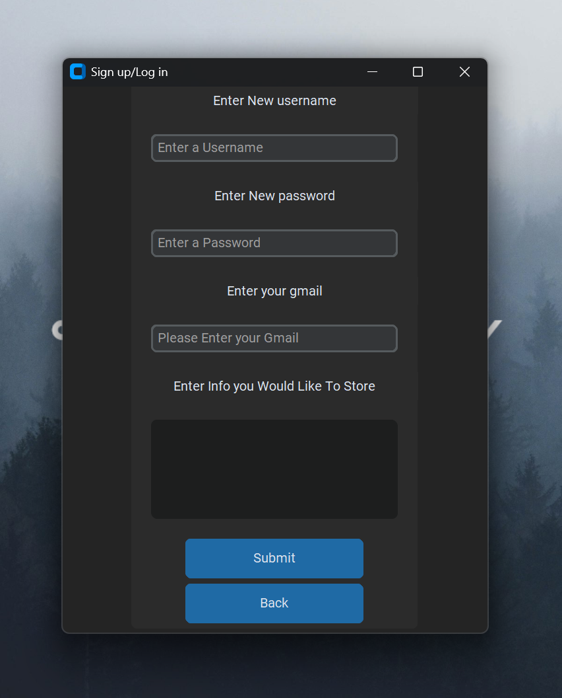
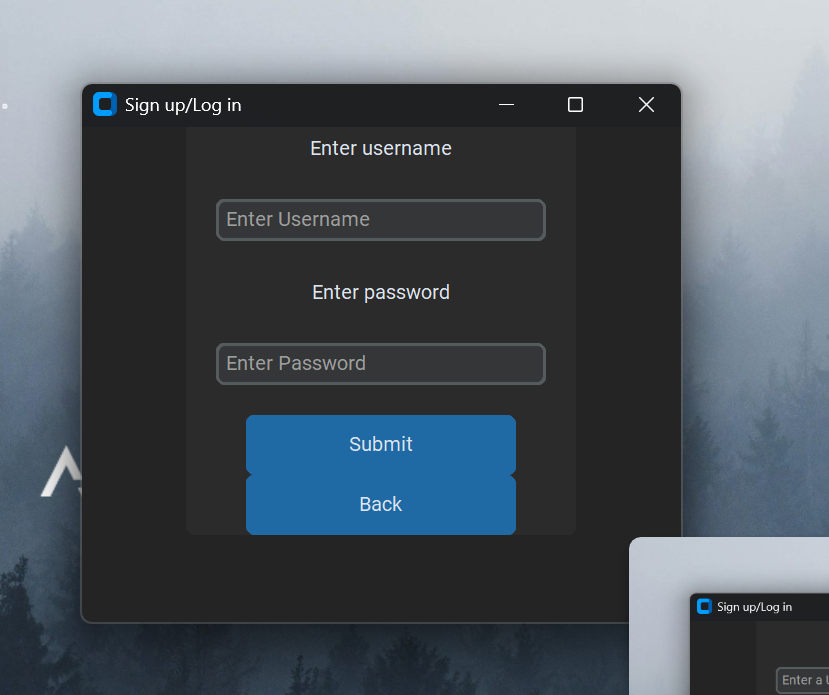
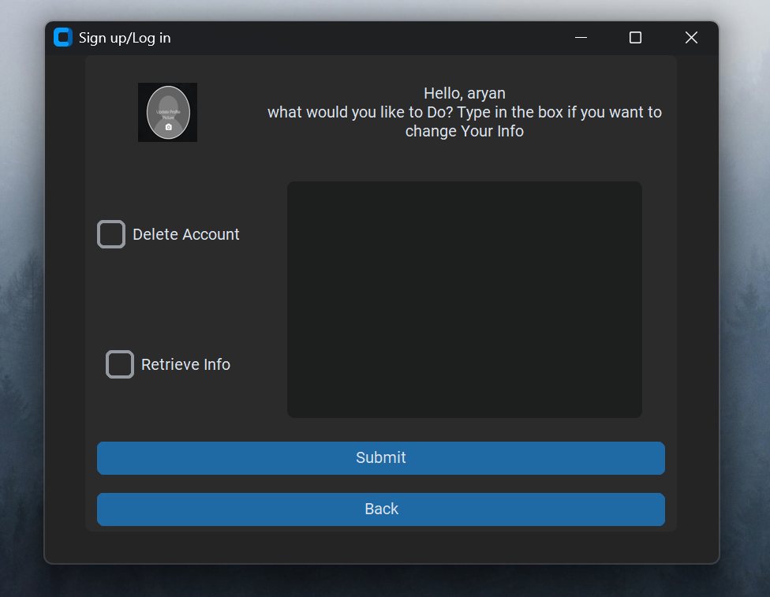

# 🔐 Login & Sign Up System

A Python desktop application with a full user authentication system — featuring bcrypt-encrypted password storage, optional Gmail-based two-factor verification, profile pictures, and account management. Built as a personal experiment to explore SQLite databases, CustomTkinter GUI, and SMTP email automation.

> ⚠️ This is a learning/experimental project. Some bugs may exist — feel free to open an issue if you find any!

---

## Author

[](https://github.com/hqwn)
[](https://www.youtube.com/@RuCode)
[](https://www.linkedin.com/in/aryan-jain-085401344/)

---

## 📸 Screenshots






---

## Features

### Authentication
- **Sign Up** — Register with a unique username (5+ characters), strong password, Gmail address, and optional personal info to store
- **Log In** — Authenticate with your username and bcrypt-verified password
- **Two-Factor Verification** — On random logins, a one-time code is emailed to your Gmail for extra security
- **Password Strength Enforcement** — Requires 8+ characters, uppercase, lowercase, digit, and a special character
- **Gmail Validation** — Only valid `@gmail.com` addresses are accepted at sign-up
- **Back Button** — Navigate back to the home screen from login or sign-up at any time

### Account Management (post-login)
- **Update Info** — Change the personal data stored on your account
- **Retrieve Info** — Fetch and display your stored info on screen
- **Change Profile Picture** — Pick any image from your file system; shown as your avatar
- **Delete Account** — Permanently remove your account from the database

### Security
- Passwords hashed with **bcrypt** — never stored in plain text
- Email credentials loaded from a `.env` file — never hardcoded
- Verification codes are 5-digit random integers sent via SMTP/TLS

---

## 🛠️ Built With

| Library | Purpose |
|---|---|
| [CustomTkinter](https://github.com/TomSchimansky/CustomTkinter) | Modern themed GUI widgets |
| [CTkMessagebox](https://github.com/Akascape/CTkMessagebox) | Styled popup dialogs |
| [bcrypt](https://pypi.org/project/bcrypt/) | Secure password hashing |
| [smtplib](https://docs.python.org/3/library/smtplib.html) | Email sending via Gmail SMTP |
| [sqlite3](https://docs.python.org/3/library/sqlite3.html) | Local user database |
| [Pillow](https://pypi.org/project/Pillow/) | Profile image loading and display |
| [python-dotenv](https://pypi.org/project/python-dotenv/) | Loading email credentials from `.env` |
| [icecream](https://pypi.org/project/icecream/) | Debug logging |

---

## Project Structure

```
Log_in-Sign_up/
├── main.py     # Main application — all GUI and logic
├── images/
│   ├── pfp.jpg         # Default profile picture fallback
│   ├── image.png       # Screenshot — home screen
│   ├── image1.png      # Screenshot — login screen
│   ├── image2.png      # Screenshot — sign up screen
│   └── image3.png      # Screenshot — dashboard
├── .env                # Your credentials (not committed — see setup)
├── .env.example        # Template showing required env variables
├── requirements.txt    # Python dependencies
└── password.db         # SQLite database (auto-generated on first run)
```

The SQLite database is created automatically on first run with this table:

```
user_data (name TEXT PRIMARY KEY, password TEXT, info TEXT, gmail TEXT, pic TEXT)
```

---

## Setup

### 1. Clone the repository

```bash
git clone https://github.com/hqwn/Log_in-Sign_up.git
cd Log_in-Sign_up
```

### 2. Install dependencies

```bash
pip install -r requirements.txt
```

### 3. Configure your Gmail credentials

Copy the example env file and fill in your details:

```bash
cp .env.example .env
```

Then edit `.env`:

```
EMAIL_ADDRESS=youremail@gmail.com
EMAIL_PASSWORD=yourapppaswordhere
```

> **How to get a Gmail App Password:**
> - Go to **myaccount.google.com → Security → 2-Step Verification** and make sure it's enabled
> - Then go to **App Passwords**, create one, and paste the 16-character password above (no spaces)

### 4. Run the app

```bash
python main.py
```

---

## How It Works

**Sign Up flow:**
1. Enter a unique username (5+ chars), strong password, Gmail, and optional info
2. Password is validated for strength, then hashed with bcrypt
3. All data is inserted into the local SQLite database

**Log In flow:**
1. Enter your username and password
2. The app verifies the password using `bcrypt.checkpw`
3. On a random ~20% of logins, a verification code is generated and emailed to your registered Gmail — you must enter it to proceed
4. On success, a personalized dashboard opens where you can manage your account and profile picture

---

## Known Limitations

- No "forgot password" or password reset flow
- Profile pictures are stored as local file paths — moving the image file will break the avatar
- The app exits after most account actions (by design for this experimental version)

---

## License

Open source and free to use for personal and educational purposes. Feel free to fork and build on it! Under MIT license.